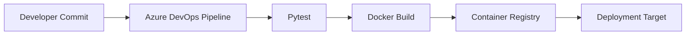

# Azure DevOps CI/CD — Containerized Python API

A hands-on DevOps portfolio project demonstrating how a small REST API can move through automated testing, containerization, and a CI/CD pipeline.

## Architecture


## What this demonstrates
- Python/Flask REST API development and troubleshooting
- Automated unit testing with pytest
- Docker image creation using a minimal Python base image
- Azure DevOps multi-stage CI/CD
- Versioned container image publishing
- Health endpoints suitable for platform probes

## Run locally
```bash
pip install -r requirements.txt
pytest -q
python app.py
```

The API listens on port 8080. Check `/health` for service health.

## Pipeline configuration
The pipeline expects an Azure DevOps container-registry service connection referenced by `containerRegistry`. Keep credentials in Azure DevOps secrets/service connections rather than source control.

## Portfolio note
This repository demonstrates the implementation and configuration pattern. A live Azure deployment is not claimed by this repository.
